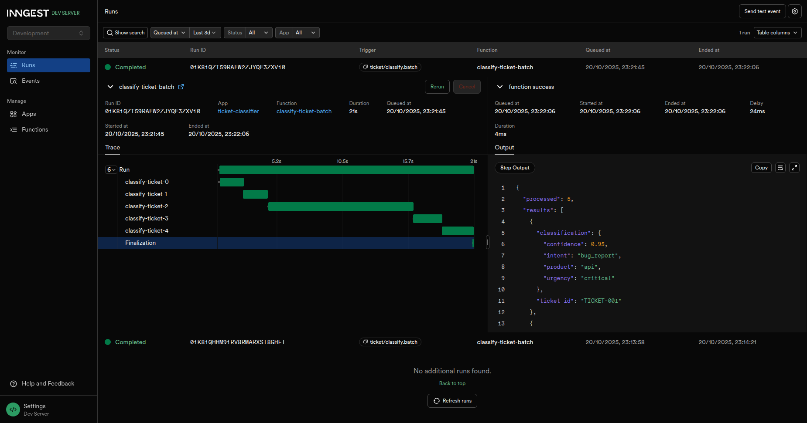

# AI Ticket Classifier

A comprehensive FastAPI-based platform for ticket classification with AI-powered using GPT-4o-mini. Automatically categorizes support tickets by urgency, intent, and product area.

## 🚀 Features

- **Automatically categorizes**: Urgency, intent, product area
- **Semantic search**: Similar tickets with semantic search
- **AI-powered**: Sentiment analysis, keyword extraction, AI summarization
- **Multilingual**: English, Spanish, French support
- **Real-time classification**: Real-time processing with background processing
- **Inngest event system**: Background processing with retry logic
- **Qdrant vector database**: Semantic search with knowledge base chat interface

## 📋 Prerequisites

- **Python 3.12+**
- **Docker & Docker Compose**
- **Qdrant** (vector database for semantic search)
- **Inngest Dev Server** (included in docker-compose)
- **~2GB RAM** (for AI models + embeddings)

## 🛠 Quick Setup

### 1. Clone Repository
```bash
git clone <your-repo-url>
cd ai-ticket-classifier
```

### 2. Environment Configuration
```bash
cp .env.example .env
# Edit .env with your configuration
```

### 3. Choose and run the environment

```bash
# Start services (Qdrant and Inngest Dev Server)
docker compose -f docker/docker-compose.dev.yml up -d

# Start FastAPI (in virtual environment)
devbox run start_app
```

**Services Running:**
- FastAPI: `http://localhost:8000`
- Inngest Dev Server: `http://localhost:8288`
- Qdrant: `localhost:6333`

## 🔧 Configuration

### **Environment Variables**

#### **Core Settings**
```bash
FASTAPI_ENV=local                    # or 'production'
DEBUG=true
```

#### **Inngest (Background Processing)**
```bash
# Dev mode: No keys needed
INNGEST_DEV_SERVER_URL=http://localhost:8288

# Production: Configure signing keys
# INNGEST_EVENT_KEY=your_event_key
# INNGEST_SIGNING_KEY=your_signing_key
```

## ⚡ Background Processing with Inngest

### **Async Job Execution**
- **Event-Driven**: Jobs processed asynchronously in background
- **Step Functions**: Multi-step pipeline with automatic retries
- **Real-time Status**: Live job progress tracking in UI
- **Failure Recovery**: Automatic retry on transient failures
- **Dev Server**: Built-in UI at `http://localhost:8288` for monitoring

### **Inngest Features**
- **Zero Infrastructure**: No Redis, no message queues needed
- **Type-Safe**: Full TypeScript/Python SDK support
- **Observability**: Built-in execution logs and debugging
- **Local Development**: Dev Server for testing and monitoring

### **Semantic Search**
- **Similar tickets**: Search for similar tickets with semantic search
- **Vector database**: Qdrant for semantic search and embeddings storage
- **Chat interface**: Knowledge base chat with vector search

## 🖥 Web Interface

### **Screenshots**

#### **Dashboard - Main View**

*Customer Support Ticket Classifier, semantic search, and recent activity*

#### **Live Job Processing**

*Batch processing with real-time progress tracking using Inngest*

#### **Detailed Results View**

*Comprehensive review analysis with AI summaries, categorization, confidence scores, and AI reasoning*

#### **Knowledge Base Chat (RAG)**

*Semantic search across reviews with adjustable similarity threshold and knowledge base integration*

#### **Video Demo**
[Video demo click to play](https://www.loom.com/share/7c831f9d72cb431ab9b9a88f713d427a?sid=8533331b-d323-4826-8668-80c6e7d9e6c6)

## 🙏 Acknowledgments

- **[Inngest](https://www.inngest.com/)** - Background job processing and workflow engine
- **[FastAPI](https://fastapi.tiangolo.com/)** - Modern Python web framework
- **[Qdrant](https://qdrant.tech/)** - Vector database for semantic search
- **[Supabase](https://supabase.com/)** - Open-source Firebase alternative
- **[Tailwind CSS](https://tailwindcss.com/)** - Utility-first CSS framework

---

**Made with ❤️ for intelligent ticket classification**